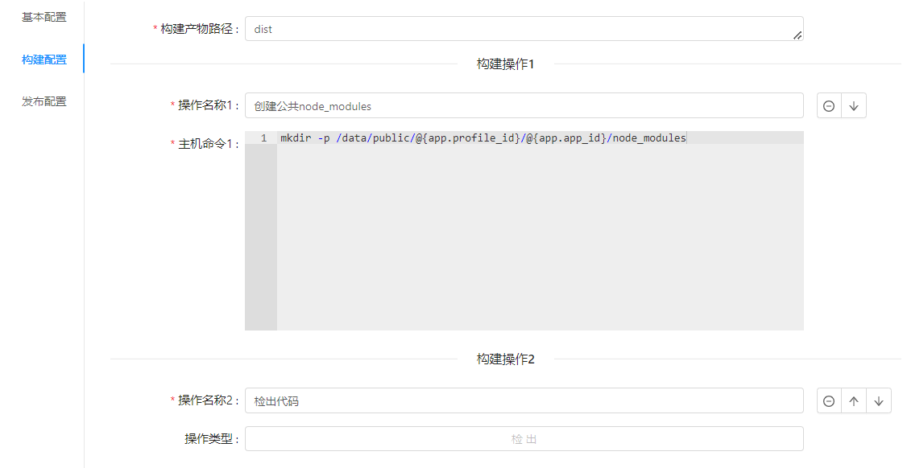
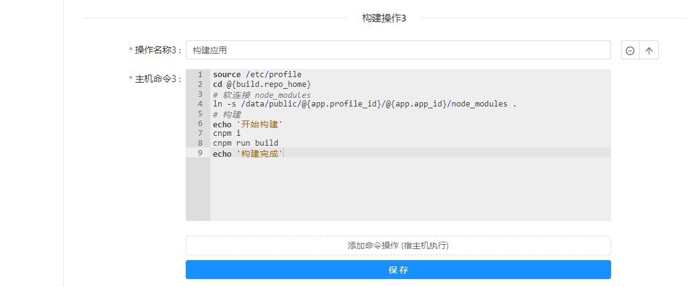
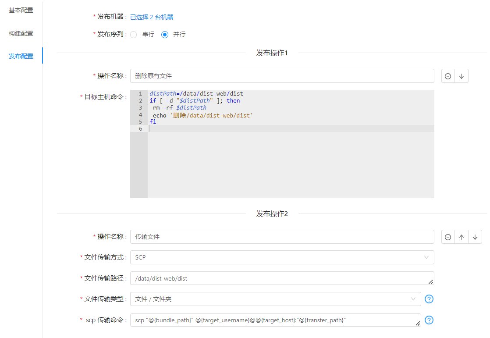
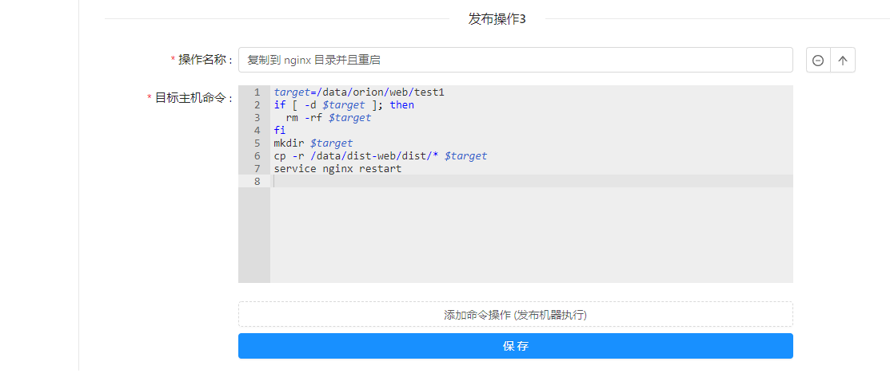

#### vue 项目模板

以一个普通的 npm 构建的 vue 项目为例  
构建操作为: `checkout` > `npm i` > `npm run build`  
发布操作为: `删除旧版文件` > `传输文件` > `复制到 nginx 静态目录` > `启动nginx`   
<br/>

> 构建配置




> 发布配置




#### 构建配置

> 构建产物路径

```
构建产物路径一般是在代码目录下的 dist 目录
dist
```  

> 构建操作1 创建公共node_modules

```
给不同环境下的每个应用创建公共 node_modules 目录, 以后每次构建都通过软链接的形式引用, 避免每次构建时都要全量安装依赖
这里的 @{app.profile_id} 代表应用环境id, @{app.app_id} 代表应用id, 在运行时会动态替换
mkdir -p /data/public/@{app.profile_id}/@{app.app_id}/node_modules
```

> 构建操作2 检出代码

无需操作

> 构建操作3 构建应用

```
source /etc/profile
cd @{build.vcs_home}
# 软连接 node_modules
ln -s /data/public/@{app.profile_id}/@{app.app_id}/node_modules .
# 构建
echo '开始构建'
cnpm i
cnpm run build
echo '构建完成'
```

#### 发布配置

> 发布操作1 删除原有文件

```
distPath=/data/dist-web/dist
if [ -d "$distPath" ]; then
 rm -rf $distPath
 echo '删除/data/dist-web/dist'
fi
```

> 发布操作2 传输文件

```
设置一个传输产物文件的绝对路径
/data/dist-web/dist
```

> 发布操作3 复制到 nginx 目录并且重启

```
target=/data/orion/web/test1
if [ -d $target ]; then
  rm -rf $target
fi 
mkdir $target
cp -r /data/dist-web/dist/* $target
service nginx restart
```
